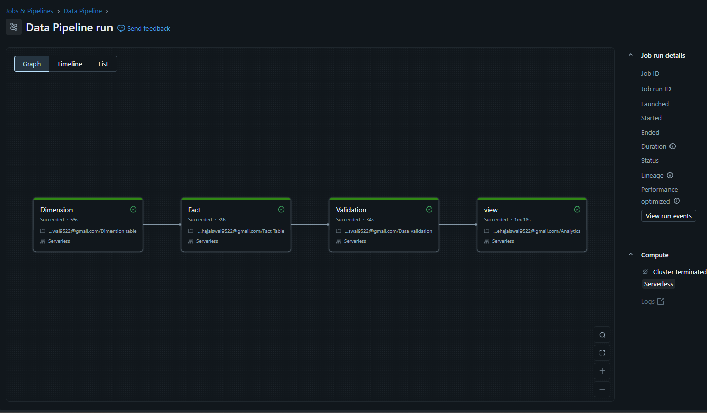
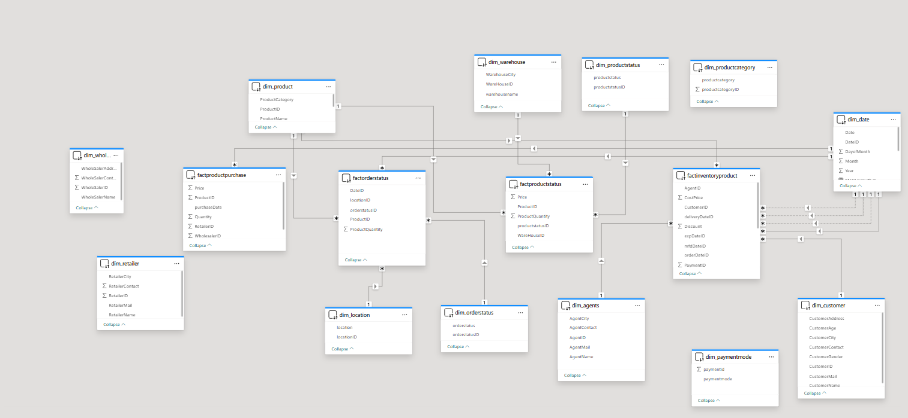
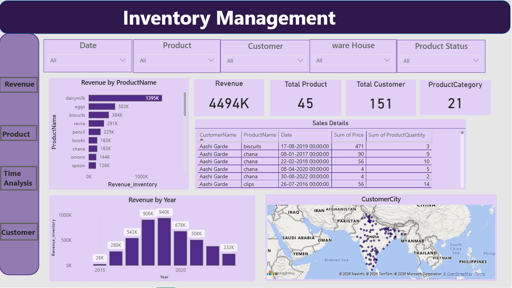
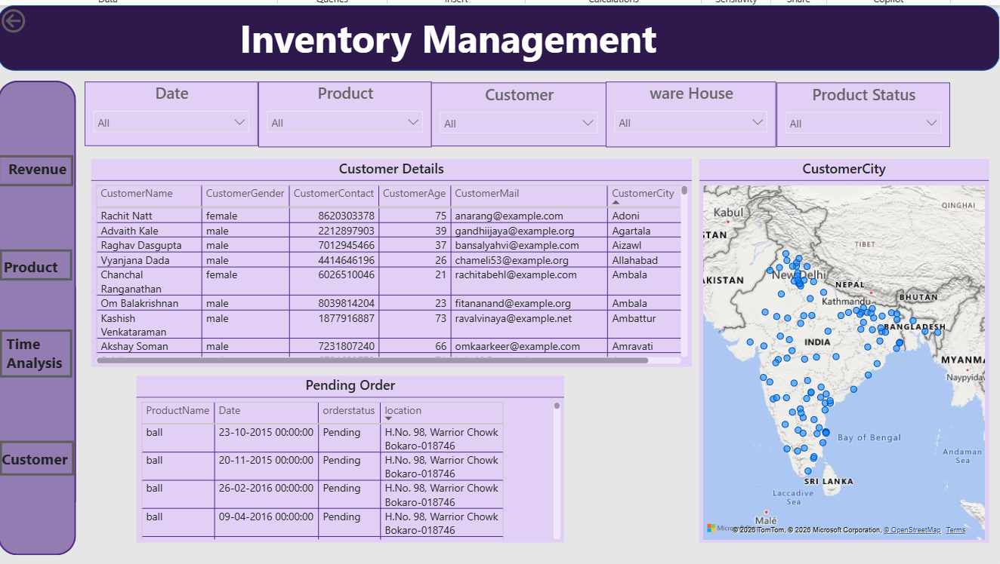
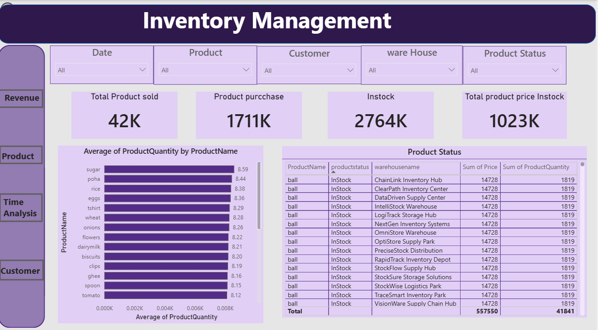
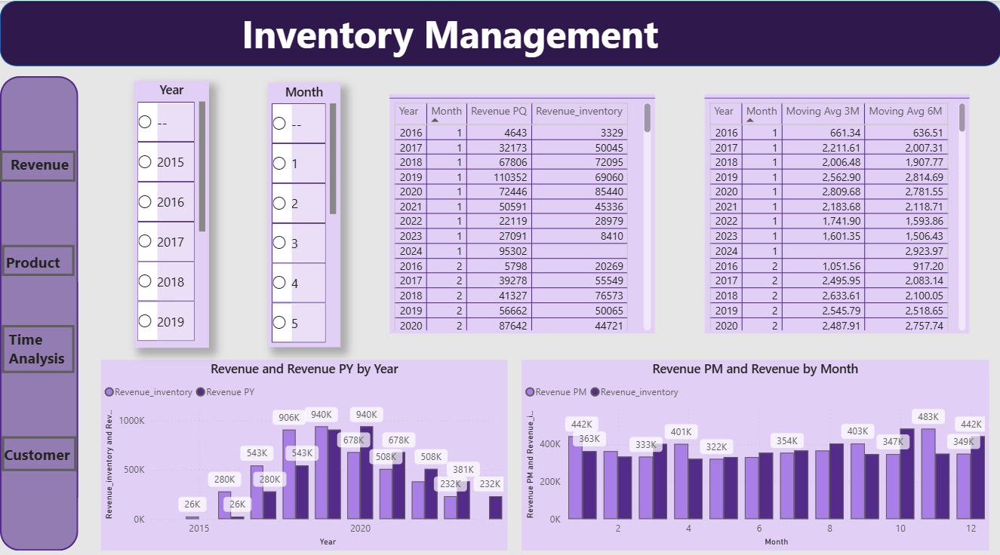

# 🛒 BharatMart Analytics Platform

> End-to-End Retail Data Warehouse — From Raw Data to Interactive Dashboard

<div align="center">

[](https://databricks.com)
[](https://powerbi.microsoft.com)
[]()
[](https://python.org)
[](https://delta.io)
[]()
[](LICENSE)

</div>

---

## 📋 Table of Contents

- [The Problem](#-the-problem)
- [Project Overview](#-project-overview)
- [Project Numbers](#-project-numbers)
- [Tools and Technologies](#️-tools-and-technologies)
- [Project Structure](#-project-structure)
- [How I Built It — Step by Step](#-how-i-built-it--step-by-step)
  - [Step 1 — Data Modeling](#️-step-1--data-modeling)
  - [Step 2 — Data Validation](#-step-2--data-validation)
  - [Step 3 — Business Analysis](#-step-3--business-analysis-30-sql-queries)
  - [Step 4 — Data Pipeline](#️-step-4--data-pipeline)
  - [Step 5 — Power BI Dashboard](#-step-5--power-bi-dashboard)
- [Key Results](#-key-results)
- [SQL Highlights](#-sql-highlights)
- [Dashboard Screenshots](#-dashboard-screenshots)
- [How to Run](#-how-to-run)
  - [Step 1 — Clone the Repository](#️-step-1--clone-the-repository)
  - [Step 2 — Upload Notebooks to Databricks](#-step-2--upload-notebooks-to-databricks)
  - [Step 3 — Create and Run the Pipeline](#️-step-3--create-and-run-the-pipeline)
  - [Step 4 — Open Power BI](#-step-4--open-power-bi-and-connect-to-databricks)
- [What I Learned](#-what-i-learned)
- [Contact](#-contact)

---

# ❗ The Problem

BharatMart is a retail business running sales across 10 warehouses,
44 products, and 50 retailer partners — all at the same time.

But all that data was sitting in raw spreadsheets with no structure.
Nobody could answer basic questions like:

- 📦 Which products are selling and which are just sitting in stock?
- 🏭 Which warehouse is running low before it becomes a problem?
- 📈 Did revenue grow compared to last year — and by exactly how much?
- ⭐ Which retailer partners are underperforming?

No structure. No visibility. No answers.

I built a full data warehouse from scratch to fix that —
from raw tables all the way to a live Power BI dashboard.

---

# 📌 Project Overview

This is an end-to-end data warehouse project built entirely on Databricks and Power BI.

I took raw retail data and structured it into a proper star schema using dimension
and fact tables. Then I validated the data, wrote 30 SQL queries as views to solve
real business questions, built an automated pipeline, and connected everything
to a 4-page interactive Power BI dashboard.

Every step is in a separate notebook — data modeling, validation, business analysis,
and pipeline — organized the way a real data engineering team would structure a project.

---

# 📊 Project Numbers

| Metric | Value |
|---|---|
| 💰 Total Revenue | ₹738,000 |
| 🧾 Total Orders | 950 |
| 📦 Products | 44 SKUs across 12 categories |
| 🏭 Warehouses | 10 locations |
| 📦 Units in Stock | 9,900 |
| 🤝 Retailer Partners | 50 |
| 👥 Customers | 150 |
| 📅 Date Range | 2015 – 2024 |
| 🔍 SQL Queries Written | 30 views |
| 📊 Dashboard Pages | 4 |
| ⚙️ Pipeline Stages | 4 (all succeeded) |

---

# 🛠️ Tools and Technologies

| Layer | Tool | Purpose |
|---|---|---|
| Data Platform | **Databricks** (Serverless) | Run all notebooks and pipeline |
| Storage | **Delta Lake** | Store all tables in structured format |
| Language | **SQL** (PySpark SQL) | Data modeling, validation, views |
| Language | **Python** (pandas, PySpark) | dim_date generation |
| Data Model | **Star Schema** | 4 fact tables + 12 dimension tables |
| Visualisation | **Power BI Desktop** | Dashboard, relationships, KPIs |
| Version Control | **Git + GitHub** | Code and notebook management |
| IDE | **VS Code** | Local editing and Git push |

---

# 📁 Project Structure

```
end-to-end-data-warehouse-with-databricks-and-powerbi/
│
├── 📁 01-business-requirements/
│   └── business-requirement.pdf          ← Full BRD with metrics and phases
│
├── 📁 02-data-modeling/
│   ├── Dimention-table.ipynb             ← All 12 dimension tables
│   └── Fact-Table.ipynb                  ← All 4 fact tables
│
├── 📁 03-data-validation/
│   └── Data_validation.ipynb             ← Row counts, nulls, distinct checks
│
├── 📁 04-business-analysis/
│   └── Analytics.ipynb                   ← 30 SQL views solving business questions
│
├── 📁 05-data-pipelines/
│   └── pipeline-config/                  ← Databricks pipeline (4 stages)
│
├── 📁 06-powerbi-dashboard/
│   └── dashboard.pbix                    ← Power BI report file
│
├── 📁 07-project-assets/
│   ├── data-pipeline.png                 ← Pipeline run screenshot
│   ├── star-schema-diagram.png           ← Star schema from Power BI model view
│   └── screenshots/                      ← Dashboard page screenshots
│
├── 📄 LICENSE                            ← MIT License
└── 📄 README.md                          ← You are here
```

---

# 🔨 How I Built It — Step by Step

## 🗂️ Step 1 — Data Modeling

The first thing I did was turn raw flat data into a proper **star schema**
using SQL on Databricks.

Built two separate notebooks — one for dimension tables, one for fact tables.

**Technique used:** Every dimension table was built using a CTE to get distinct values
from the raw source, then `ROW_NUMBER()` to generate surrogate keys.
Each table also has an `Unknown` row (ID = -1) as a default for null joins.

**12 Dimension Tables built:**

| Table | Source | Key Columns |
|---|---|---|
| `dim_customer` | bharat_mart_dataset | CustomerID, Name, City, Gender, Age |
| `dim_product` | bharat_mart_dataset | ProductID, ProductName, Category |
| `dim_retailer` | bharat_mart_dataset | RetailerID, Name, City, Contact |
| `dim_agents` | bharat_mart_dataset | AgentID, Name, City, Contact |
| `dim_warehouse` | bharat_mart_dataset | WareHouseID, Name, City |
| `dim_paymentmode` | bharat_mart_dataset | PaymentID, PaymentMode |
| `dim_date` | Python (pandas) | DateID, Date, Year, Month, DayOfMonth |
| `dim_orderstatus` | order_status | OrderStatusID, OrderStatus |
| `dim_productstatus` | samplestock_csv | ProductStatusID, ProductStatus |
| `dim_productcategory` | bharat_mart_dataset | ProductCategoryID, ProductCategory |
| `dim_wholesales` | purchasehistory | WholeSalerID, Name, Address, Contact |
| `dim_location` | order_status | LocationID, Location |

> 💡 `dim_date` was the only table built in Python using pandas to generate
> a full date range from `2015-06-01` to `2024-10-30`, then loaded into Delta Lake.

**4 Fact Tables built:**

| Table | What it captures |
|---|---|
| `FactInventoryProduct` | Core sales — customer, product, agent, warehouse, payment, 4 date joins |
| `FactProductPurchase` | Purchase history — price, quantity, wholesaler, retailer |
| `FactOrderStatus` | Order tracking — status, location, product, quantity |
| `FactProductStatus` | Current stock — product status (InStock / LowStock), warehouse |

---

## ✅ Step 2 — Data Validation

After building all tables I ran a **separate validation notebook** before
touching any business analysis.

**What I validated for every table:**
- ✅ Non-null counts for every key column
- ✅ Distinct value counts (to catch duplicates)
- ✅ Min and max date range on `dim_date`
- ✅ Row counts on all 4 fact tables
- ✅ Foreign key columns checked across fact and dimension joins


---

## 🔍 Step 3 — Business Analysis (30 SQL Queries)

Wrote 30 SQL queries as **reusable views** in a dedicated Analytics notebook.
These views are what Power BI connects to directly.

**SQL techniques used:**
`Window Functions` · `LAG / LEAD` · `RANK / DENSE_RANK` · `CTEs` ·
`CASE WHEN` · `GROUP BY` · `Subqueries` · `NULLIF` · `FORMAT_NUMBER` · `DATEDIFF`

**All 30 views organized by category:**

**📈 Revenue & Time Intelligence**
| View | What it answers |
|---|---|
| `vw_yearly_revenue_breakdown` | Revenue per year from 2016–2022 |
| `vw_yoy_revenue` | Year-over-year growth comparison |
| `vw_monthly_revenue` | Month-over-month growth using LAG() |
| `vw_quarterly_revenue` | Quarter-over-quarter growth using LAG() |
| `vw_moving_averages` | 3-month and 6-month moving averages |
| `vw_cumulative_revenue` | Running total revenue over time |

**📦 Inventory & Stock**
| View | What it answers |
|---|---|
| `vw_inventory_value` | Inventory value by warehouse city |
| `vw_total_products_in_stock` | Total units in stock (9.9K) |
| `vw_stock_status` | InStock vs LowStock quantity split |
| `vw_low_stock` | All products currently flagged as LowStock |
| `vw_InStock` | All products currently flagged as InStock |
| `vw_stock_out_prediction` | Products at risk of stock-out next month |

**🛍️ Products & Categories**
| View | What it answers |
|---|---|
| `vw_top_revenue_generating_products` | Top 5 products by revenue |
| `vw_product_category_performance` | Revenue rank across 12 categories |
| `vw_product_performance` | RANK and DENSE_RANK within each category |
| `vw_avg_order` | Average order value per product |

**👥 Customers**
| View | What it answers |
|---|---|
| `vw_customer_segmentation` | Customers ranked by total purchase value |
| `vw_geographic_distribution` | Revenue by customer city (map-ready) |
| `vw_gender_based_purchasing_patterns` | Revenue and quantity split by gender |
| `vw_customer_acquisition` | New customers acquired per year (cohort) |

**📋 Orders & Operations**
| View | What it answers |
|---|---|
| `vw_pending_orders` | All pending orders with aging buckets (0–10, 11–30, 30+) |
| `vw_pending_orders_location` | Pending orders with customer city |
| `vw_order_status_workflow` | Orders by status (Pending, Shipped, Delivered) |
| `vw_fulfillment_time_region` | Delivery date minus order date per transaction |
| `vw_warehouse_efficiency` | Stock value and units per warehouse |
| `vw_currecnt_inventory_value` | Inventory value grouped by location |

---

## ⚙️ Step 4 — Data Pipeline

Connected all 4 notebooks into a single **automated Databricks pipeline**.



```
Stage 1          Stage 2       Stage 3          Stage 4
─────────────    ──────────    ──────────────   ──────────────
Dimension        Fact          Validation       Views
Succeeded ✅     Succeeded ✅  Succeeded ✅     Succeeded ✅
55 seconds       39 seconds    34 seconds       1 min 18 sec
```

All 4 stages run sequentially on **Serverless compute** —
each stage only starts after the previous one succeeds.

---

## 📊 Step 5 — Power BI Dashboard

Connected Databricks directly to Power BI using the Databricks connector.

Built the full **star schema relationship model** in Power BI model view,
then created a 4-page interactive dashboard on top of the views.



**Dashboard Pages:**

| Page | What's on it |
|---|---|
| 📈 Sales | Revenue KPIs, yearly trend chart, top products bar chart, filters |
| 🏭 Inventory | Warehouse stock table, InStock vs LowStock split, inventory value |
| 📦 Products | Category performance, product ranking, order status workflow |
| 🗺️ Geographic | Customer city map, city-wise revenue, gender split |

**Features used in Power BI:**
- 🔗 Relationships between all fact and dimension tables
- 🎛️ Slicers and filters on every page
- 📊 Bar charts, line charts, pie charts, KPI cards
- 🗺️ Map visual for geographic distribution
- 📋 Data tables with conditional formatting

> ❌ **Skipped:** Service appointments, customer reviews, and retailer review
> performance were part of the original business requirements but were **not built**
> because the raw source data did not contain that information.

---

# 📈 Key Results

After connecting everything, the data revealed clear patterns:

- 🏆 **Revenue peaked at ₹164K in 2020** — this trend was completely invisible
  before the year-over-year view was built
- 👟 **Shoes = ₹212K** — just 3 products (Shoes, Books, T-shirts) drive
  nearly 50% of all revenue
- ⚠️ **Stock gap found** — 22,700 units purchased but only 21,700 sold —
  automatically flagged in the reorder prediction view
- 🏪 **Event Services dominates** at ₹39.3M — nearly double second place
  (Floral ₹22.8M) — a pattern leadership had no visibility into before
- 📊 **Stock split** — majority products are InStock, but LowStock items
  are now tracked automatically with warehouse-level detail

---

# 💻 SQL Highlights

**Year-over-Year Revenue using LAG():**
```sql
CREATE OR REPLACE VIEW invt.vw_yoy_revenue AS
SELECT
  dd.Year,
  SUM(ft.Price * ft.ProductQuantity) AS revenue,
  LAG(SUM(ft.Price * ft.ProductQuantity)) OVER (ORDER BY dd.Year) AS prev_year_revenue,
  ROUND(
    (SUM(ft.Price * ft.ProductQuantity) - LAG(SUM(ft.Price * ft.ProductQuantity)) OVER (ORDER BY dd.Year))
    / NULLIF(LAG(SUM(ft.Price * ft.ProductQuantity)) OVER (ORDER BY dd.Year), 0) * 100
  , 2) AS yoy_growth_pct
FROM invt.factinventoryproduct AS ft
JOIN invt.dim_date AS dd ON ft.orderDateID = dd.DateID
WHERE dd.Year BETWEEN 2016 AND 2022
GROUP BY dd.Year;
```

**Product Ranking within Category using DENSE_RANK():**
```sql
CREATE OR REPLACE VIEW invt.vw_product_performance AS
SELECT
  dp.ProductCategory,
  dp.ProductName,
  SUM(ft.ProductQuantity * ft.Price) AS revenue,
  RANK() OVER (PARTITION BY dp.ProductCategory
               ORDER BY SUM(ft.ProductQuantity * ft.Price) DESC) AS revenue_rank,
  DENSE_RANK() OVER (PARTITION BY dp.ProductCategory
                     ORDER BY SUM(ft.ProductQuantity * ft.Price) DESC) AS revenue_dense_rank
FROM invt.factinventoryproduct AS ft
JOIN invt.dim_product AS dp ON ft.ProductID = dp.ProductID
GROUP BY dp.ProductCategory, dp.ProductName;
```

**3-Month and 6-Month Moving Averages:**
```sql
CREATE OR REPLACE VIEW invt.vw_moving_averages AS
SELECT
  Year, Month, revenue,
  ROUND(AVG(revenue) OVER (
    ORDER BY Year, Month ROWS BETWEEN 2 PRECEDING AND CURRENT ROW
  ), 2) AS ma_3_month,
  ROUND(AVG(revenue) OVER (
    ORDER BY Year, Month ROWS BETWEEN 5 PRECEDING AND CURRENT ROW
  ), 2) AS ma_6_month
FROM invt.vw_monthly_revenue;
```

---

# 📸 Dashboard Screenshots








---

# 🚀 How to Run

> ✅ **Prerequisites** — Make sure you have these before starting:
> - Databricks workspace (Community Edition works)
> - Power BI Desktop (free — download from microsoft.com/powerbi)
> - Git installed on your machine

---

## ⬇️ Step 1 — Clone the Repository

Open your terminal and run:

```bash
git clone https://github.com/Snehajais555/end-to-end-data-warehouse-with-databricks-and-powerbi.git
```

```bash
cd end-to-end-data-warehouse-with-databricks-and-powerbi
```

---

## 📤 Step 2 — Upload Notebooks to Databricks

Go to your Databricks workspace and upload all 4 notebooks
from this repo **in exactly this order:**

```
📂 Upload this first  →  02-data-modeling/Dimention-table.ipynb
📂 Upload second      →  02-data-modeling/Fact-Table.ipynb
📂 Upload third       →  03-data-validation/Data_validation.ipynb
📂 Upload fourth      →  04-business-analysis/Analytics.ipynb
```

> ⚠️ Order matters — fact tables depend on dimension tables being created first.

---

## ⚙️ Step 3 — Create and Run the Pipeline

In Databricks, go to **Jobs & Pipelines** and create a new pipeline.
Add all 4 notebooks as stages in this sequence:

```
Stage 1  →  Dimention-table.ipynb      (creates all 12 dimension tables)
Stage 2  →  Fact-Table.ipynb           (creates all 4 fact tables)
Stage 3  →  Data_validation.ipynb      (validates row counts and integrity)
Stage 4  →  Analytics.ipynb            (creates all 30 SQL views)
```

Click **Run** — all 4 stages should complete with:

```
✅ Dimension   — Succeeded
✅ Fact        — Succeeded
✅ Validation  — Succeeded
✅ Views       — Succeeded
```

---

## 📊 Step 4 — Open Power BI and Connect to Databricks

```
1. Open file:  06-powerbi-dashboard/dashboard.pbix
2. Go to:      Home → Transform Data → Data Source Settings
3. Update:     Databricks Server Hostname
4. Update:     HTTP Path  (find this in Databricks → Compute → your cluster)
5. Click:      Sign In → use your Databricks credentials
6. Click:      Close & Apply
7. Click:      Refresh All
```

> 💡 All visuals will populate automatically once the connection is live —
> no manual data entry needed.

---


# 🧠 What I Learned

**On data modeling:**
- Building dimension tables first forces you to understand the business before writing a single fact table — you can't model what you don't understand
- Every table needs a grain decision — one row means one thing — getting that wrong breaks every query downstream
- The `Unknown` row (ID = -1) in every dimension table handles null joins gracefully instead of dropping records

**On SQL:**
- Window functions like `LAG()`, `RANK()`, and `AVG() OVER()` answer questions that are completely impossible with basic `GROUP BY`
- CTEs make complex queries readable — breaking a 40-line query into named steps means you can actually debug it
- `NULLIF()` in division prevents divide-by-zero errors silently — important in growth percentage calculations

**On Power BI:**
- The relationship model in Power BI is not automatic — cardinality and cross-filter direction matter for every join
- Connecting live to Databricks means your dashboard always reflects the latest data without manual refresh
- Splitting into 4 pages forces you to think about who is looking at each page and what decision they need to make

**On the overall project:**
- Finding a data mismatch during validation and documenting it honestly is more professional than ignoring it
- An end-to-end project teaches you things that no single tutorial can — you see how a bad decision in Step 1 breaks something in Step 5

---

# 📬 Contact

**Sneha Jaiswal**
📧 snehajaiswal9522@gmail.com
🔗 [LinkedIn](https://www.linkedin.com/in/sneha-jaiswal555)
🐙 [GitHub](https://github.com/Snehajais555)

---

<div align="center">

**⭐ If this project helped you — give it a star!**

*BharatMart Analytics Platform · Built March 2026 · Sneha Jaiswal*

</div>